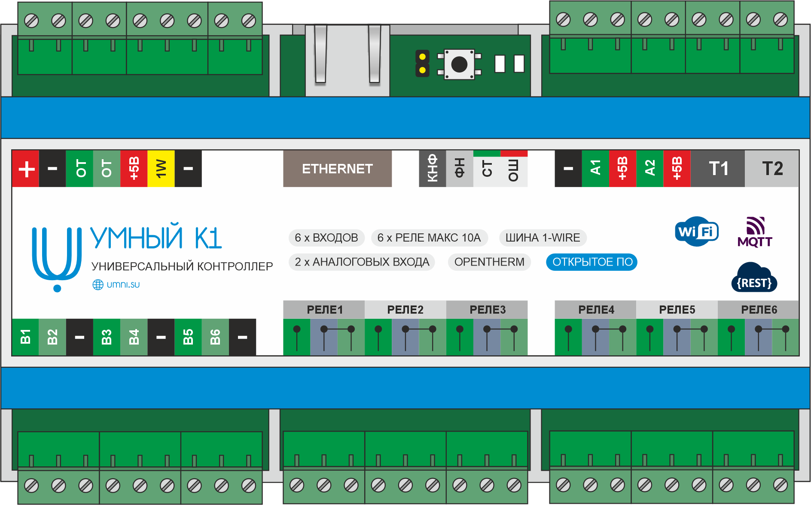
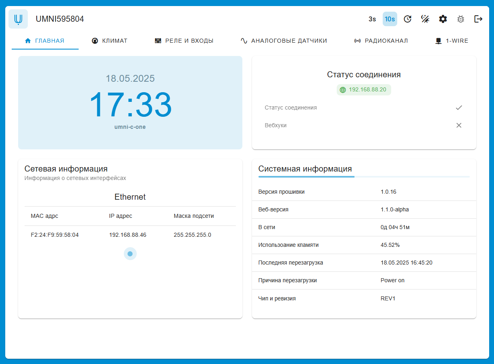
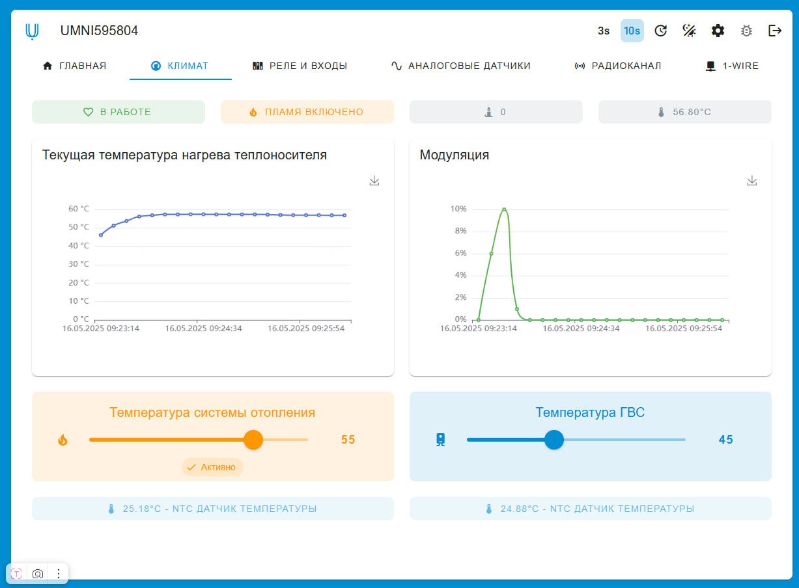
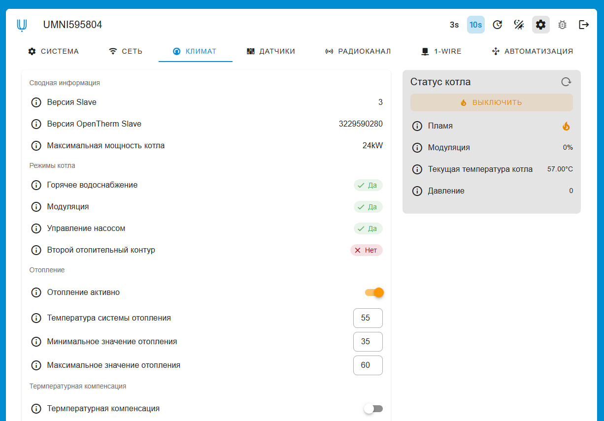
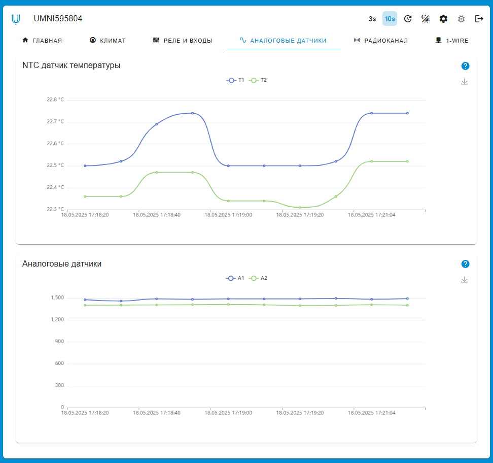
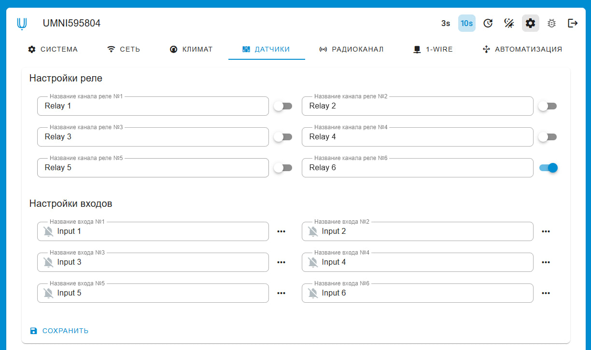
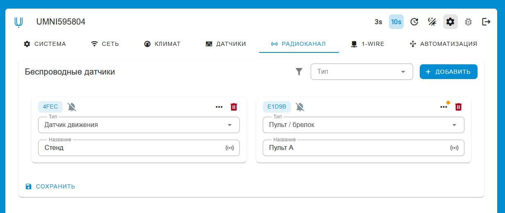

# УМНЫЙ К1 (прошивка)


Данный репозиторий хранит исходные файлы и файлы релизов программного обеспечения контроллера "УМНЫЙ К1".



## Скриншоты
Веб-интерфейс расположен в репозитории https://github.com/umni-su/umni-c1-frontend








## Лицензия
MIT. УМНЫЙ предоставляет простые и доступные решения с открытым исходным кодом.

## Установка

1. Установить VS Code и ESP-IDF расширение для него. Процесс настройки расширения можно найти в интернете, но все интуитивно понятно. 

    ```
    git clone https://github.com/umni-su/umni-c1-firmware.git umni-c1-firmware

    cd umni-c1-firmware

    ```

2. Запустить процесс сборки или прошивки устройства.

## Участие в проекте

Вы можете отправить issue или pull request. Приветствуются любые идеи по улучшению функционала.
Смотрите [CONTRIBUTING.md](CONTRIBUTING.md)

## Поддерживаниемые устройства

- Контроллер УМНЫЙ К1 (рекомендуется)
- Любой контроллер с необходимым набором переферии на базе ESP32

## Документация
Документация находится по адресу - https://docs.umni.su

## Сайт
Официальный сайт - https://umni.su

## Авторы
Смотрите [AUTHORS.md](AUTHORS.md)
